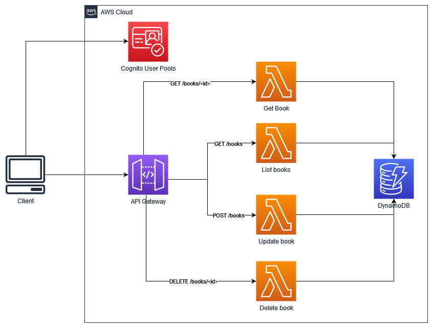

# Reading List API

#### Tables of Contents:

- [Overview](#overview)
- [Project Structure](#project-structure)
- [Requirements](#requirements)
- [Setup Environment](#setup-environment)
  - [Lambda](#lambda)
  - [API Gateway](#api-gateway)
  - [Cognito](#cognito)
- [Testing](#🧪-testing)
- [Clean Up Resources](#clean-up-resources)

---

## Overview

Welcome to this mini workshop! Here you will learn to build and deploy Reading List API using RESTful API, AWS Lambda, Amazon API Gateway, Amazon Cognito, and Amazon DynamoDB. Please take a look the architecture below.

<p align="center">

</p>

> The content of this mini workshop may be updated and if you have questions or find issues in this mini workshop, please file them as an Issue.

## Project Structure

```md
reading-list-api/
├─ functions/
├─ .gitignore
├─ architecture.png
├─ LICENSE
├─ README.md
```

- [`functions/`](/functions/) contains lambda function code for the API.
- [`architecture.png`](/architecture.png) is an overview of the resources to be deployed.
- [`README.md`](/README.md) contains guide for this mini workshop.

## Requirements

Before starting this mini workshop, the following runtime/tools must be met and configured properly.

- Active [AWS Account](https://aws.amazon.com/).
- [NodeJS](https://nodejs.org/en) `v16` or latest.
- [AWS CLI version 2](https://aws.amazon.com/cli/).
- API Testing Tools.
  > **Note** </br>
  > This mini workshop will use [`curl`](https://curl.se/) to test the APIs. However, you can use your favorite API testing tools (e.g. Postman/Insomnia/Thunder Client/etc).
- (optional) OS based on Linux.
  > **Note** </br>
  > Build script for package lambda function code and it's dependecies require Linux/Unix shell to operate. If you are using an OS other than Linux and/or your device doesn't support Linux shell commands you can customize [this build script](/functions/build.sh) to make sure it runs properly.

### AWS Resources

Some of the services from AWS that are used in this mini workshop are as follows:

- [AWS Lambda](https://aws.amazon.com/lambda/)
- [Amazon API Gateway](https://aws.amazon.com/api-gateway/)
- [Amazon Cognito](https://aws.amazon.com/cognito/)
- [Amazon DynamoDB](https://aws.amazon.com/dynamodb/)

---
